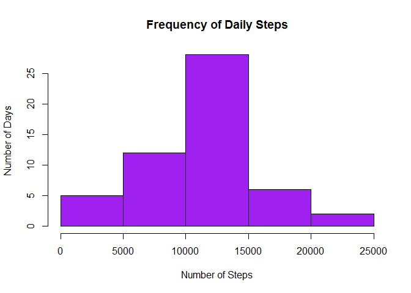
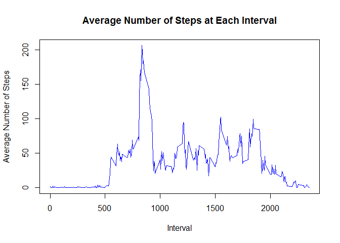
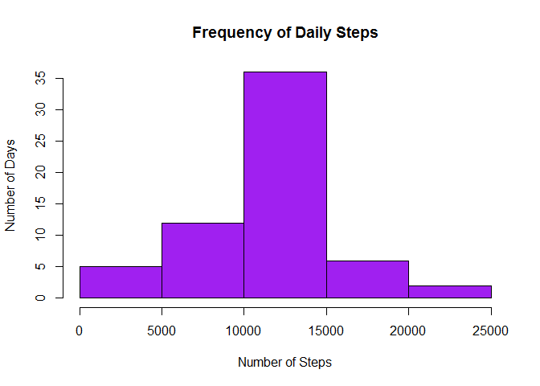
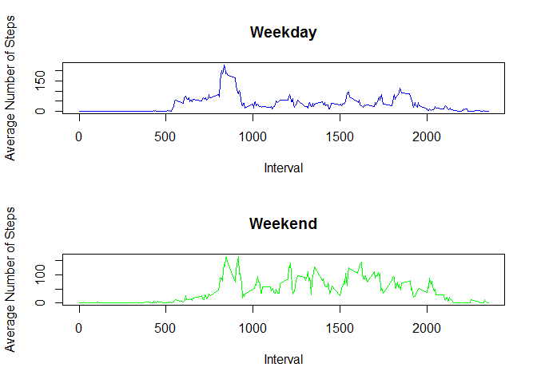

# Reproducible Research: Peer Assessment 1


## Loading and preprocessing the data


```r
# Load required libraries
library(dplyr)
```

```
## Warning: package 'dplyr' was built under R version 3.2.5
```

```
## 
## Attaching package: 'dplyr'
```

```
## The following objects are masked from 'package:stats':
## 
##     filter, lag
```

```
## The following objects are masked from 'package:base':
## 
##     intersect, setdiff, setequal, union
```

```r
library(ggplot2)
```

```
## Warning: package 'ggplot2' was built under R version 3.2.5
```

```r
# Read the activity data from the CSV file.
act_data = read.csv("./activity.csv")

# Convert the dates into POSIX datatype
act_data <- mutate(act_data, date=as.POSIXct(act_data$date, format="%Y-%m-%d"))
```
## What is mean total number of steps taken per day?


```r
# Compute the sum of the number of steps per day.
stepsperday <- aggregate(act_data$steps, list(date = act_data$date), sum)

# Present as a histogram
hist(stepsperday$x, col="purple", main="Frequency of Daily Steps", xlab="Number of Steps", ylab="Number of Days")
```

<!-- -->

```r
# Compute the mean steps per day
mean(stepsperday$x, na.rm=TRUE)
```

```
## [1] 10766.19
```

```r
# Compute the median steps per day
median(stepsperday$x, na.rm=TRUE)
```

```
## [1] 10765
```

## What is the average daily activity pattern?


```r
# Average the number of steps per each 5-minute interval across all days
avgstepsperinterval <- aggregate(act_data$steps, list(interval = act_data$interval), mean, na.rm=TRUE)

# Plot the averages on a line graph
plot(avgstepsperinterval, type="l", main="Average Number of Steps at Each Interval", xlab="Interval", "Average Number of Steps", col="blue")
```

<!-- -->

```r
# Find the maximum average number of steps in any interval
maxavgsteps = max(avgstepsperinterval[, 2])

# Find which interval had this max
avgstepsperinterval[avgstepsperinterval[,2] == maxavgsteps, ][,1]
```

```
## [1] 835
```

## Imputing missing values


```r
# Count how many NAs appear in the data
sum(is.na(act_data$steps))
```

```
## [1] 2304
```

```r
# Round off the average number of steps for each interval, and merge this with the activity data to give
# us a new data frame with a column "x" that represents the average steps for each row's interval
act_data_imputed <- merge(act_data, round(avgstepsperinterval), by="interval")

# For any row where the number of steps is NA, use the average for the interval as the imputed value.
act_data_imputed[which(is.na(act_data_imputed$steps)), "steps"] <- act_data_imputed[which(is.na(act_data_imputed$steps)), "x"]

# Present a histogram using the data frame with the imputed values
stepsperday_imputed <- aggregate(act_data_imputed$steps, list(date = act_data_imputed$date), sum)
hist(stepsperday_imputed$x, col="purple", main="Frequency of Daily Steps", xlab="Number of Steps", ylab="Number of Days")
```

<!-- -->

```r
# Compute the mean and median steps per day
mean(stepsperday_imputed$x, na.rm=TRUE)
```

```
## [1] 10765.64
```

```r
median(stepsperday_imputed$x, na.rm=TRUE)
```

```
## [1] 10762
```

## Are there differences in activity patterns between weekdays and weekends?


```r
# Define which days are weekends
weekends <- c('Saturday', 'Sunday')

# Add a new column to the data with a factor labeling each row as a weekend or a weekday
act_data_imputed$daytype <- factor((weekdays(act_data_imputed$date) %in% weekends), levels=c(FALSE, TRUE), labels=c('weekday', 'weekend'))

# Split the data frame into two - one for weekends and one for weekdays
weekday_steps <- act_data_imputed[act_data_imputed$daytype=='weekday', c('steps', 'interval')]
weekend_steps <- act_data_imputed[act_data_imputed$daytype=='weekend', c('steps', 'interval')]

# Compute the average steps per interval for both weekdays and weekends
avgstepsperinterval_weekday <- aggregate(weekday_steps, list(interval = weekday_steps$interval), mean)
avgstepsperinterval_weekend <- aggregate(weekend_steps, list(interval = weekend_steps$interval), mean)

# Next we want to graph it

# Set the layout to be two rows and one column
par(mfrow=c(2,1))

# In the first position, plot a line graph that shows average steps per interval on weekdays
with(avgstepsperinterval_weekday, plot(interval, steps, col="blue", type="l", ylab="Average Number of Steps", xlab="Interval", main="Weekday"))

# In the second position, plot a line graph that shows average steps per interval on weekends
with(avgstepsperinterval_weekend, plot(interval, steps, col="green", type="l", ylab="Average Number of Steps", xlab="Interval", main="Weekend"))
```

<!-- -->
